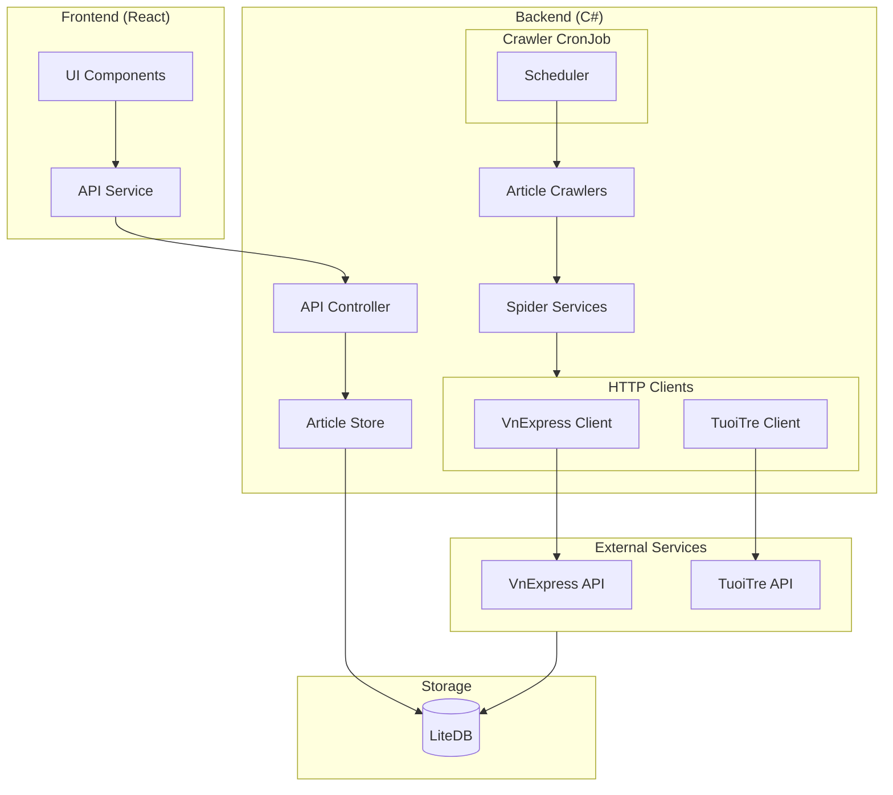
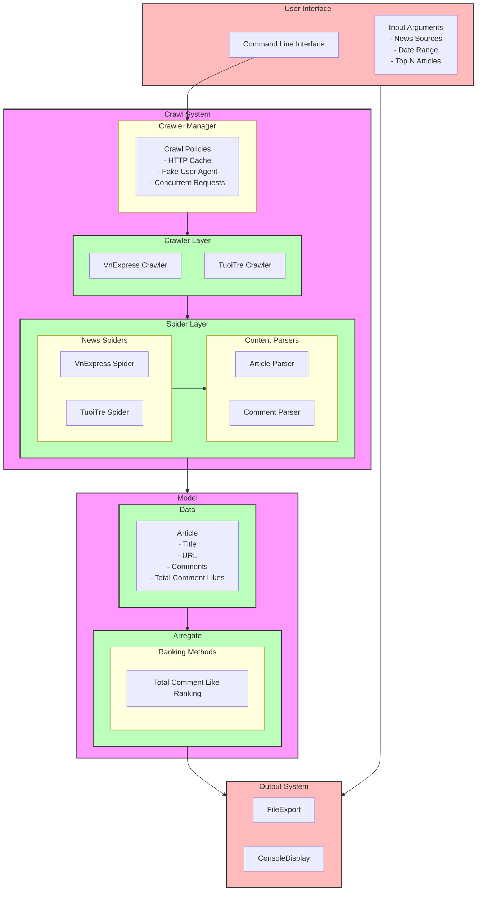

# CSpider

### Prerequisites

- .NET 9.0 SDK
- Docker

### Installation

1. Restore the dependencies:
    ```sh
   # Run this - I met some problem on MacOS when building this project
   rm -rf */obj */bin 
   dotnet restore
    ```

2. Build the project:
    ```sh
    dotnet build
    ```

### Running Tests

To run the tests, use the following command:
```sh
dotnet test
```

### Docker

To build and run the Docker container:

1. Build the Docker image:
    ```sh
    docker build -t cspider .
    ```

2. Run the Docker container:
    ```sh
    docker run -p 8080:8080 cspider
    ```

### Usage

You can use the provided `CSpider.http` file to test the API endpoints. For example, to fetch articles:

```http
GET {{CSpider_HostAddress}}/articles?from_date=2024-12-30&to_date=2025-01-02&source=tuoitre&limit=20
Accept: application/json
```

## Configuration

- `BaseUrl`: The base URL of the website.
- `CommentApiUrl`: The URL for the comment API.
- `HttpClientConfig`: Configuration for the HTTP client, including retry settings.
- `CrawlerConfig`: Configuration for the crawler policies.


# Project Structure

- Mermaid Diagram - Supported by Claude


# Tree Folder

```mermaid
├── Api
│   ├── Controllers
│   │   ├── ArticlesController.cs
│   │   ├── CrawlerCronJob.cs
│   │   └── HealthController.cs
│   └── DTO
│       ├── ApiResponse.cs
│       └── ArticlesDTO.cs
├── CSpider.Tests
│   ├── CSpider.Tests.csproj
│   ├── Core
│   │   └── Crawler
│   │       ├── TuoiTreArticleCrawlerTests.cs
│   │       └── VnexpressArticleCrawlerTests.cs
│   ├── Fixtures
│   │   └── ArticleStoreFixture.cs
│   ├── Infrastructure
│   │   └── Client
│   │       ├── TuoiTreClientTests.cs
│   │       └── VnExpressClientTests.cs
│   ├── Seed
│   │   └── Seed.cs
│   └── Store
│       └── ArticleStoreTests.cs
├── CSpider.csproj
├── CSpider.http
├── CSpider.sln
├── CSpider.sln.DotSettings.user
├── Config
│   └── Config.cs
├── Core
│   ├── Crawler
│   │   ├── TuoiTreArticleCrawler.cs
│   │   └── VnExpressArticleCrawler.cs
│   ├── Interface
│   │   ├── IArticleCrawler.cs
│   │   ├── IArticleService.cs
│   │   └── IArticleSpider.cs
│   ├── Models
│   │   └── Article.cs
│   ├── Services
│   │   └── ArticleService.cs
│   └── Spider
│       ├── Common.cs
│       ├── TuoiTreArticleSpider.cs
│       └── VnExpressArticleSpider.cs
├── Dockerfile
├── Infrastructure
│   ├── Client
│   │   ├── PageRequesterCustom.cs
│   │   ├── TuoiTreClient.cs
│   │   └── VnExpressClient.cs
│   └── Store
│       └── ArticleStore.cs
├── Makefile
├── Program.cs
├── Properties
│   └── launchSettings.json
├── README.md
├── Utils
│   └── Helper.cs
├── appsettings.Development.json
├── appsettings.json
└── data
    └── articles.db

```
# Design

- Mermaid Diagram - Supported by Claude

