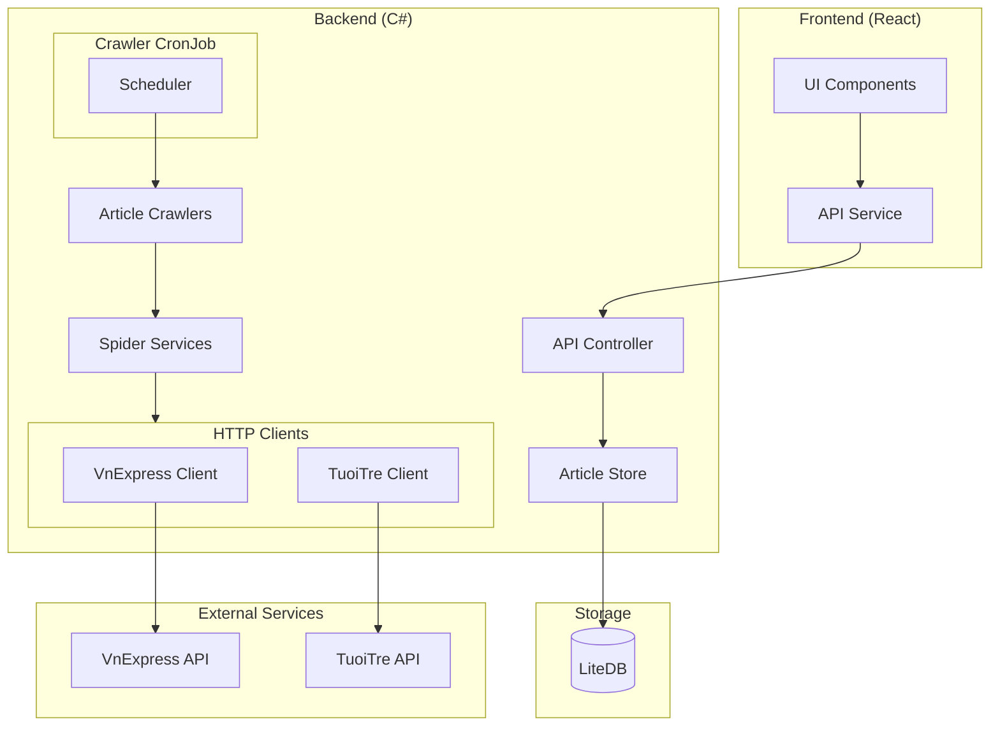
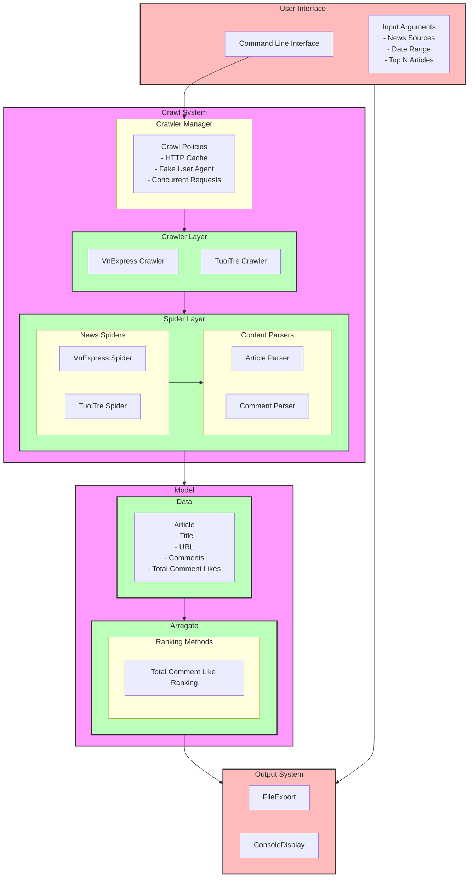

# CSpider

# Project Structure

- Mermaid Diagram - Supported by Claude

```mermaid
flowchart TB
    subgraph Frontend["Frontend (React)"]
        UI["UI Components"]
        APIService["API Service"]
    end

    subgraph Backend["Backend (C#)"]
        API["API Controller"]
        Crawler["Article Crawlers"]
        Spider["Spider Services"]
        Store["Article Store"]
        
        subgraph CronJob["Crawler CronJob"]
            Scheduler["Scheduler"]
        end
        
        subgraph Clients["HTTP Clients"]
            VEC["VnExpress Client"]
            TTC["TuoiTre Client"]
        end
    end

    subgraph Storage["Storage"]
        DB[(LiteDB)]
    end

    subgraph External["External Services"]
        VE["VnExpress API"]
        TT["TuoiTre API"]
    end

    UI --> APIService
    APIService --> API
    API --> Store
    Store --> DB
    
    Scheduler --> Crawler
    Crawler --> Spider
    Spider --> Clients
    VEC --> VE
    TTC --> TT
```

# Design

- Mermaid Diagram - Supported by Claude

```mermaid
flowchart TB
    subgraph UserInterface["User Interface"]
        CLI["Command Line Interface"]
        Config["Input Arguments
        - News Sources
        - Date Range
        - Top N Articles"]
    end

    subgraph CoreSystem["Crawl System"]
        subgraph Manager["Crawler Manager"]
            CrawlPolicies["Crawl Policies
           - HTTP Cache
           - Fake User Agent
           - Concurrent Requests"]
        end
        
        subgraph CrawlerLayer["Crawler Layer"]
            direction BT
            VECrawler["VnExpress Crawler"]
            TTCrawler["TuoiTre Crawler"]
        end
        
        subgraph SpiderLayer["Spider Layer"]
            subgraph NewsSpiders["News Spiders"]
                direction RL
                VESpider["VnExpress Spider"]
                TTSpider["TuoiTre Spider"]
            end 
            subgraph Parsers["Content Parsers"]
                direction RL
                ArticleParser["Article Parser"]
                CommentParser["Comment Parser"]
            end
        end
    end

    subgraph OutputSystem["Output System"]
        FileExport
        ConsoleDisplay
    end

    subgraph Model["Model"]
        subgraph RankingEngine["Arregate"]
            direction RL
            subgraph Strategies["Ranking Methods"]
                LikeRanking["Total Comment Like Ranking"]
            end
        end
        subgraph DataLayer["Data"]
                direction RL
                Article["Article
                - Title
                - URL
                - Comments
                - Total Comment Likes"]
        end
    end 

    %% Flow connections
    CLI --> Manager
    Manager --> CrawlerLayer
    CrawlerLayer --> SpiderLayer
    NewsSpiders --> Parsers
    SpiderLayer --> Model
    
    DataLayer --> RankingEngine

    RankingEngine --> OutputSystem
    UserInterface --> OutputSystem

    %% Styling
    classDef system fill:#f9f,stroke:#333,stroke-width:2px
    classDef component fill:#bfb,stroke:#333,stroke-width:2px
    classDef interface fill:#fbb,stroke:#333,stroke-width:2px
    
    class CoreSystem,Model system
    class RankingEngine,CrawlerLayer,SpiderLayer,DataLayer component
    class UserInterface,OutputSystem interface
```
